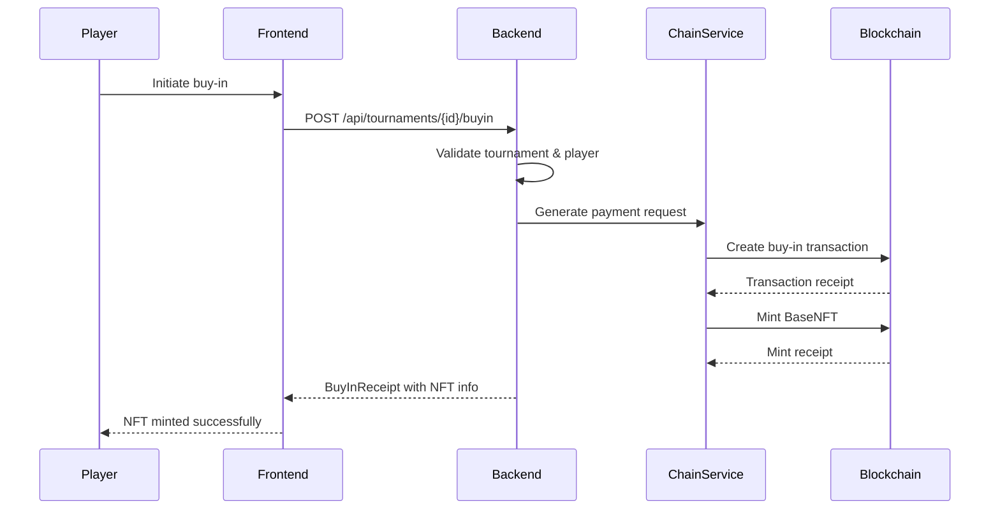
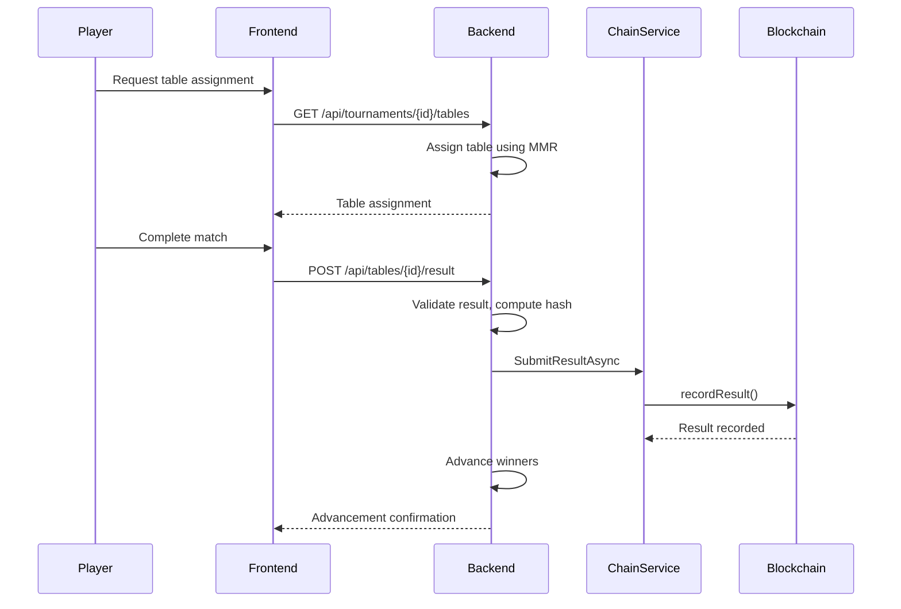
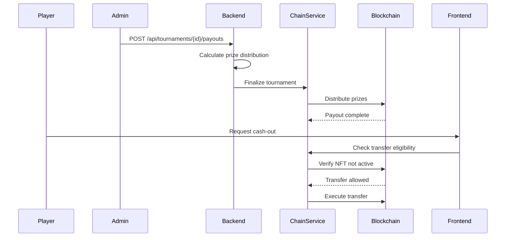

# Poker-Style Tournament Ladder Design

## Overview
A blockchain-integrated tournament system where players buy in with crypto, receive a Base NFT representing their persistent "chips", and compete through match pools to advance while carrying their Base forward.

## Key Components

### Smart Contracts
1. **BaseNFT.sol** (ERC-721)
   - `mintTo(address player, uint256 tournamentId, string metadataURI)`
   - `activeTournamentId` field with transfer guard
   - Transfer restrictions while active in tournament

2. **TournamentFactory.sol**
   - Creates tournament instances
   - Stores parameters: buyInToken, amount, tableSize, advanceK, rakeBps, prizeSplit schema

3. **TournamentEscrow.sol**
   - Receives and locks buy-in funds
   - `recordResult(tableId, winnerTokenId, bytes32 commitHash)`
   - Role-gated RESULT_RELAYER for backend integration
   - Releases payouts after tournament finalization

4. **Registry.sol**
   - Central address registry
   - Role management system

### Data Models

#### Tournament Entity
```csharp
public class Tournament
{
    public Guid Id { get; set; }
    public string Name { get; set; }
    public decimal BuyInAmount { get; set; }
    public string BuyInToken { get; set; }
    public int TableSize { get; set; }
    public int AdvanceCount { get; set; }
    public int RakeBps { get; set; }
    public TournamentStatus Status { get; set; }
    public DateTime StartTime { get; set; }
    public DateTime? EndTime { get; set; }
    public List<Table> Tables { get; set; }
    public List<Entry> Entries { get; set; }
}
```

#### Entry Entity
```csharp
public class Entry
{
    public Guid Id { get; set; }
    public Guid TournamentId { get; set; }
    public string PlayerAddress { get; set; }
    public string BaseNFTTokenId { get; set; }
    public int CurrentTableId { get; set; }
    public bool IsActive { get; set; }
    public decimal MMR { get; set; }
    public List<Snapshot> Snapshots { get; set; }
}
```

#### Table Entity
```csharp
public class Table
{
    public Guid Id { get; set; }
    public Guid TournamentId { get; set; }
    public int RoundNumber { get; set; }
    public TableStatus Status { get; set; }
    public List<Entry> Entries { get; set; }
    public Guid? WinnerEntryId { get; set; }
}
```

## Flow Sequence

### 1. Buy-In & Mint


### 2. Match & Advance


### 3. Payout & Cash-Out


## Fairness Rules

### Carry-Forward Mechanism
```
effective_power = floor(raw_power ^ 0.92)
```

### Table Assignment
- MMR-based matching within tolerance ranges
- Minimum wait time enforcement
- Geographic region consideration

### Anti-Cheating Measures
- Deterministic battle log hashing
- Merkle root commitments for snapshots
- Time-stamped result submissions
- Multi-signature verification for critical operations

## Configuration Parameters

| Parameter | Description | Default |
|-----------|-------------|---------|
| `advanceK` | Number of players advancing per table | 1 |
| `rakeBps` | Tournament fee in basis points | 200 (2%) |
| `tableSize` | Players per table | 8 |
| `mmrTolerance` | MMR range for matching | 100 |
| `maxRounds` | Maximum tournament rounds | 10 |
| `timePerRound` | Round duration in minutes | 30 |

## Security Considerations

- Transfer locks during active tournament participation
- Role-based access control for admin functions
- Escrow fund protection mechanisms
- Result finality and dispute resolution procedures
- Front-running protection in smart contracts

## Deployment Architecture

```
Frontend (Unity) → Backend API (.NET 8) → Blockchain (Polygon/Base)
                     │
                     ├── PostgreSQL (Tournament Data)
                     ├── Redis (Caching & Sessions)
                     └── S3/IPFS (Snapshot Storage)
```

This design ensures a secure, transparent, and engaging tournament experience while maintaining the fun-first philosophy of Chain Empires.
